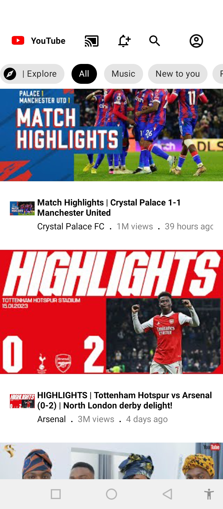

# Youtube App
 
## Youtube API Documentation
- This is a Cloned-Youtube App that fetches popular Videos from [Youtube DATA API > Documentation](https://developers.google.com/youtube/v3/docs/)
 
## Generate Youtube Api key
- [Follow this tutorial to generate your own API KEY](https://blog.hubspot.com/website/how-to-get-youtube-api-key)

# Screens

 
 
 

    

# Development Environment

* You will require latest version of Android Studio 3.0 (or newer) to be able to build the app
* Android Studio Dolphin | 2021.1.1 Patch 2 or Higher
* Language: Kotlin
* Build System: Gradle

# Tech Stack

- Tech Stack
  - [Kotlin](https://kotlinlang.org/) - First class and official programming language for Android development.
  - [Android Jetpack](https://developer.android.com/jetpack) https://developer.android.com/topic/libraries/data-binding/
    * [Data Binding](https://developer.android.com/topic/libraries/data-binding/) - A support library that allows you to bind UI components in your layouts to data sources in your app using a declarative format rather than programmatically.
    * [LiveData](https://developer.android.com/topic/libraries/data-binding/) - An observable,lifecycle-aware data holder.
    * [Room](https://developer.android.com/topic/libraries/architecture/room) - a persistence library provides an abstraction layer over SQLite.
    * [Lifecycle](https://developer.android.com/topic/libraries/architecture/lifecycle) - perform action when lifecycle state changes.
    * [ViewModel](https://developer.android.com/topic/libraries/architecture/viewmodel) - store and manage UI-related data in a lifecycle conscious way.
  - [Kotlin coroutines](https://kotlinlang.org/docs/reference/coroutines-overview.html) - Executing code asynchronously.
  - [Retrofit](https://square.github.io/retrofit/) - Type-safe HTTP client for Android and Java and Kotlin by Square, Inc.
  - [GsonConverterFactory](https://github.com/square/retrofit/tree/master/retrofit-converters/gson) - JSON library for Android, Java and Kotlin
  - [OkHttp interceptor](https://github.com/square/okhttp/tree/master/okhttp-logging-interceptor) - Logs HTTP requests and responses
  - [Flow](https://kotlinlang.org/docs/reference/coroutines/flow.html) - An asynchronous version of a Sequence, a type of collection whose values are lazily produced. Flow handles the stream of data asynchronously that executes sequentially.
  - [Dagger-Hilt](https://insert-koin.io/) - Hilt is a dependency injection library for Android that reduces the boilerplate of doing manual dependency injection in your project.
  - [Paging - 3](https://developer.android.com/codelabs/android-paging#5) - The Paging library makes it easier for you to load data incrementally and gracefully within your app's UI

- Gradle
  * [Gradle Kotlin DSL](https://docs.gradle.org/current/userguide/kotlin_dsl.html) - For reference purposes, here's an [article](https://evanschepsiror.medium.com/migrating-to-kotlin-dsl-4ee0d6d5c977) explaining the migration.
  * Plugins
      - [KtLint](https://github.com/JLLeitschuh/ktlint-gradle) - creates convenient tasks in your Gradle project that run ktlint checks or do code auto format.
      
      
## POSTMAN - Testing API
 
 

